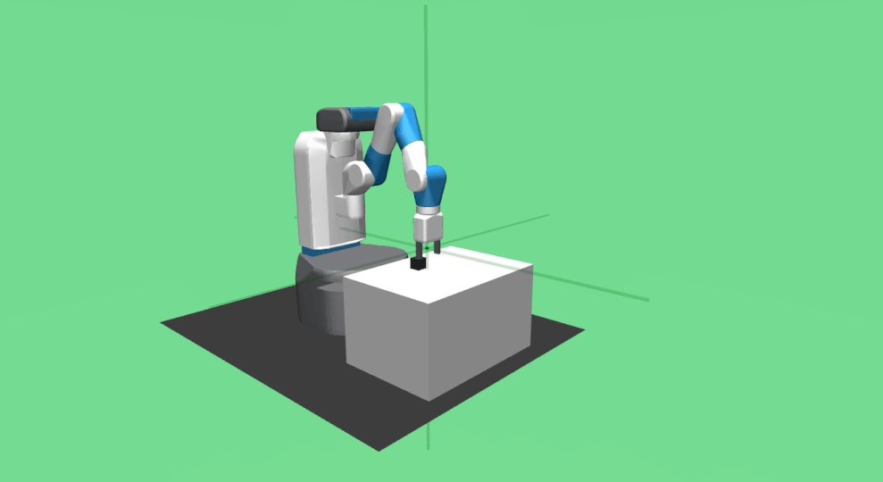

# Python Reinforcement Learning Agents

Different reinforcement learning agents implemented in Python. The current
version uses Pytorch ![Pytorch Logo][pytorch-16px], but more frameworks may be supported in the future.


## Requirements 📋

The main requirement is a Python 3 interpreter, preferably 3.5 or newer but
it should work just as fine with previous versions. If you do not have a
valid interpreter you are probably running Windows or MacOS, for these systems
we recommend using [Conda][miniconda].

Additionally, to avoid polluting your Python's system-wide environment we
recommend creating a virtual environment, for example:

```
python3 -m venv ~/.virtualenvs/rl
```

or, if you use conda:

```
conda create --name rl
```

Finally, with the Python environment set up, we just need to install the
required packages, which are all avaliable through PyPi, run

```
pip install -r requirements.txt
```

to install them all.


## Implemented Algorithms

The current version implements the following list of reinforcement learning
algorithms.

 * Discrete Action Spaces
   * **TODO**
 * Continuous Action Spaces
   * [Deep Deterministic Policy Gradient (DDPG)][ddpg]
   * [Twin Delayed Deep Deterministic Policy Gradient (TD3)][td3]
   * [Soft Actor-Critic (SAC)][sac]

Additionally, some of them have also been implemented using the [Hindsight
Experience Replay][her] technique, thereby they can be used in environments
with sparse rewards. These are: *DDPG*, *TD3* and *SAC*.


## Using the agents in Gym environments ![gym-32px]

The packages can be run as a Python script using the command `python -m pyrl`,
by running the package you can choose among different entry points to train/test
the different agents on OpenAI gym environments. For example, to train the
*DDPG* agent on the *Bipedal Walker* environment use the command:

```bash
python3 -m pyrl ddpg-train BipedalWalker-v3
```

The command above will run a generic *DDPG* training routine on the *Bipedal
Walker* environment, and save the agent in a subdirectory named *ddpg*. But
there are more options, to get the list of all the available entry points and
some package wide options use the *-h/--help* flag:

```bash
python3 -m pyrl --help
```

Moreover, there are several options specific to to each train/test entry points
that can be used to configure some aspects of the train/test routines. To get
these options use the *-h/--help* flag after the entry point, for example:

```bash
python -m pyrl ddpg-train --help
python -m pyrl ddpg-test --help
```

### Example DDPG on Bipedal Walker


**TODO:** Add bipedal walker test GIF.

## Package structure ![technologist-32px]

This package does not have a formal documentation yet, methods are just
documented within the code. In the meantime, if instead of using the package
entry points you would rather write your own routines or integrate the agents
in your project, here we provide you with some insights to help you navigate
the package and use the agents.

First, we would like to show you the different subpackages and explain what
can be found inside them, then we will explain the Agent interface, which
defines the methods that all Agents must implement and should be enough to
train and use them.

 * *pyrl.agents*: This package contains the agents interface, their
    implementation and some utility modules that implement some components
    used by more than one agent, for example *pyrl.agents.noise* contains
    different action and parameter noise strategies, *pyrl.agents.replay_buffer*
    contains replay buffers designed to be memory efficient, etc.

 * *pyrl.cli*: Inside this package you will find the "command line interface",
    a.k.a the entry points of the generic train/test routines, that work on
    OpenAI gym environments. The code in this module may help you understand
    how to train an agent and later on use it however you want.

 * *pyrl.trainer*: The trainer is an utility that runs multiple copies of the
    same agent on the same environment with different seeds. The key point is
    that after each training step the "master" agent aggregates the results of
    all the copies and then synchronizes the result.

 * *pyrl.util*: Contains routines and classes that can be useful in various
    places.

### Agent Interface

```python
class BaseAgent:
    """Base Agent interface."""

    @property
    def num_train_steps(self):
       """Number of times the agent has been trained."""

    def init_summary_writter(self, log_path):
       """Initializes a tensorboard summary writter to track the agent"""

    def set_eval_mode(self):
        """Sets the agent in evaluation mode."""

    def set_train_mode(self, mode=True):
        """Sets the agent training mode."""

    def begin_episode(self):
        """Prepares the agent to run a new training episode.

        Some agents have to prepare to register a new training
        episode, for example by emptying buffers, reseting noise, etc.
        """

    def end_episode(self):
        """Indicates the agent that the episode that started in a previous
        call to `begin_episode` has finished.

        When `end_episode` is called the agent can use all the experience
        gathered on calls to `update` to compute metrics and move data
        from temporary to persisten buffers.
        """

    def update(self, state, action, reward, next_state, terminal):
        """Registers the transition and updates any agent internal information
        useful for training.

        :param state: State from which the agent decided to take `action`.
        :param action: Action taken to move from `state` to `next_state`.
        :param reward: Reward received for taking `action` from `state`.
        :param next_state: State reached after taking `action`.
        :param terminal: Whether or not `next_state` is a terminal state.
        """

    def compute_action(self, state):
        """Computes the next action to take given the current `state` of
        the environment.

        This function may behave differently depending on the agent
        mode, evaluation or training, for example by adding noise to
        explore unknown states.
        """

    def train(self, steps, progress=False):
        """Trains an agent for the specified number of `steps`.

        :param steps: The number of steps to train the agent for.
        :param progress: If set the training progress is printed on the
            standard output stream (using tqdm).
        """

    def state_dict(self):
        """Returns a dictionary containing the whole state of the agent.

        The content depends on the type of agent and may include neural
        nets, running averages, etc.

        :return: A dictionary containing the whole state of the agent.
        :rtype: dict
        """

    def load_state_dict(self, state):
        """Copies the state into this agent. Any additional key in the
        dictionary is ignored.

        Unless you know what you are doing you should only pass dictionaries
        returned by `state_dict()`.

        :param state: A dict containing a valid agent state.

        :raise KeyError: If a required key is not in the dictionary.
        """

    def aggregate_state_dicts(self, states):
        """Aggregates the content of multiple states into this agent.

        This method is mainly intended for distributed training.

        :param states: A list of states (dictionaries) valid for this agent.
        """

    def save(self, path, replay_buffer=True):
        """Saves the agent in the given `path`.

        Different agents may save their state using different formats
        but the preferred way is using `path` as a root directory that
        will contain all the agent components.

        :param replay_buffer: Whether the replay buffer should be saved
            or not.
        """
```

## More Examples

 * SAC on *FetchReach* Environment
   
 * HER+TD3 on *FetchPickAndPlace* Environment
   

<!-- ***** References ***** -->
[ddpg]: https://arxiv.org/abs/1509.02971 "arXiv: Continuous control with deep reinforcement learning"
[td3]: https://arxiv.org/abs/1802.09477 "arXiv: Addressing Function Approximation Error in Actor-Critic Methods"
[sac]: https://arxiv.org/abs/1801.01290 "arXiv: Soft Actor-Critic: Off-Policy Maximum Entropy Deep Reinforcement Learning with a Stochastic Actor"
[her]: https://arxiv.org/abs/1707.01495 "arXiv: Hindisght Experience Replay"

[miniconda]: https://docs.conda.io/en/latest/miniconda.html "Free minimal installer for conda"

<!-- ***** Images ***** -->
[gym-16px]: images/gym-16.png "OpenAI Gym Logo 16px"
[gym-32px]: images/gym-16.png "OpenAI Gym Logo 32px"

[pytorch-32px]: images/pytorch-32.png "Pytorch Logo 32x32"
[pytorch-16px]: images/pytorch-16.png "Pytorch Logo 16x16"

[technologist-16px]: images/technologist-16.png "Technologist Emoji 16x16"
[technologist-32px]: images/technologist-32.png "Technologist Emoji 32x32"